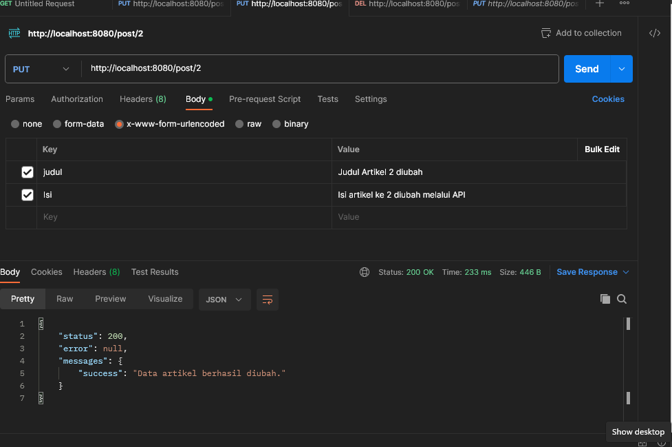
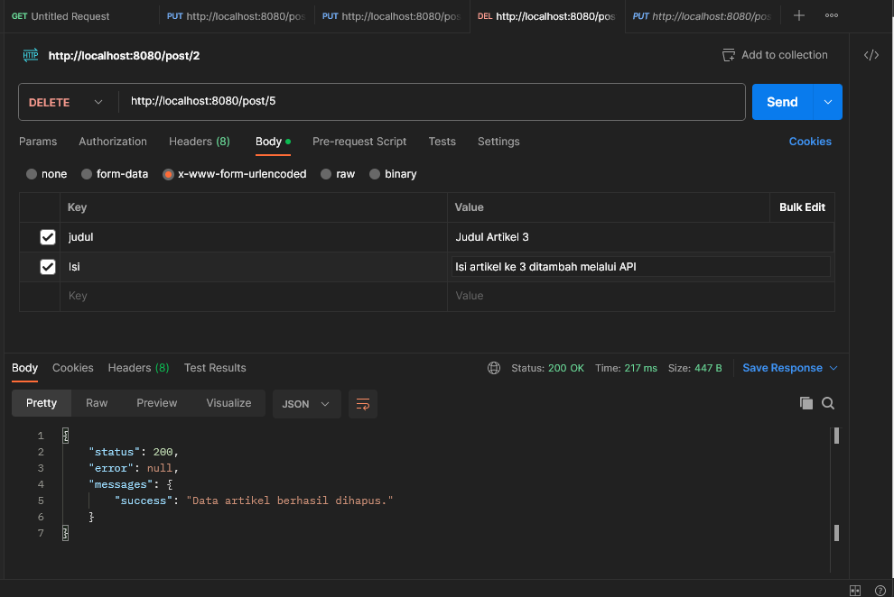
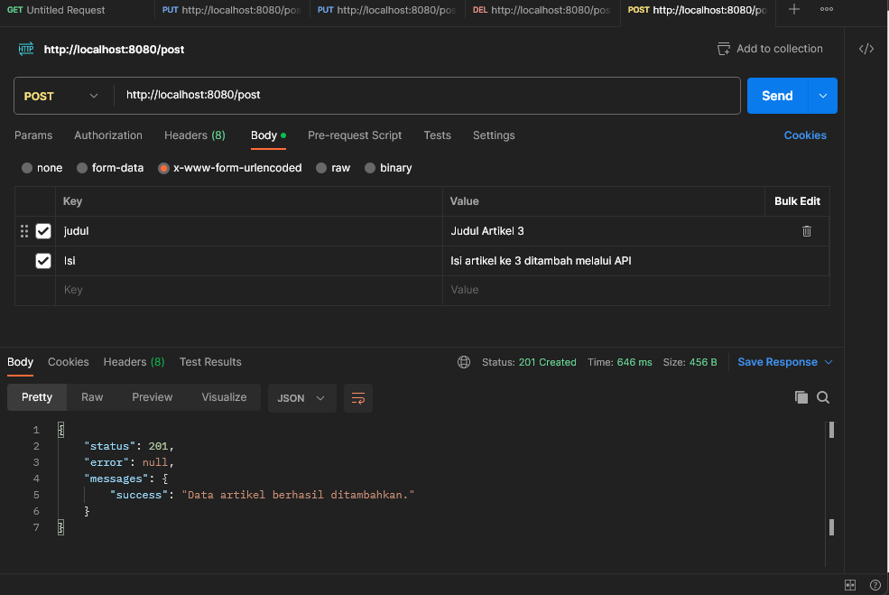

# Lab12Web

## Profil
| #               | Biodata              |
| --------------- | -----------------    |
| **Nama**        | Anindia Sasikirana   |
| **NIM**         | 312110268            |
| **Kelas**       | TI.21.A.2            |
| **Mata Kuliah** | Pemrograman Web 2    |


# Lanjutan PHP Frame Work (Codeigniter) 
## 1. Membuat REST Controller dulu sebelum buat REST API, lalu download juga POSTMAN. lalu buat file REST Controller yang berisi fungsi untuk melihat, menambah, dan menghapus data. Buka direktori app/Controllers dan buat file baru bernama Post.php. kode di bawah ini 

```
<?php
namespace App\Controllers;
use CodeIgniter\RESTful\ResourceController;
use CodeIgniter\API\ResponseTrait;
use App\Models\ArtikelModel;
class Post extends ResourceController
{
use ResponseTrait;
// all users
public function index()
{
$model = new ArtikelModel();
$data['artikel'] = $model->orderBy('id', 'DESC')->findAll();
return $this->respond($data);
}
// create
public function create()
{
$model = new ArtikelModel();
$data = [
'judul' => $this->request->getVar('judul'),
'isi' => $this->request->getVar('isi'),
];
$model->insert($data);
$response = [
'status' => 201,
'error' => null,
'messages' => [
'success' => 'Data artikel berhasil ditambahkan.'
]
];
return $this->respondCreated($response);
}
// single user
public function show($id = null)
{
   $model = new ArtikelModel();
$data = $model->where('id', $id)->first();
if ($data) {
return $this->respond($data);
} else {
return $this->failNotFound('Data tidak ditemukan.');
}
}
// update
public function update($id = null)
{
$model = new ArtikelModel();
$id = $this->request->getVar('id');
$data = [
'judul' => $this->request->getVar('judul'),
'isi' => $this->request->getVar('isi'),
];
$model->update($id, $data);
$response = [
'status' => 200,
'error' => null,
'messages' => [
'success' => 'Data artikel berhasil diubah.'
]
];
return $this->respond($response);
}
// delete
public function delete($id = null)
{
$model = new ArtikelModel();
$data = $model->where('id', $id)->delete($id);
if ($data) {
$model->delete($id);
$response = [
'status' => 200,
'error' => null,
'messages' => [
'success' => 'Data artikel berhasil dihapus.'
]
];
return $this->respondDeleted($response);
} else {
return $this->failNotFound('Data tidak ditemukan.');
}
}
}
```

## 2. Membuat Routing REST API Untuk mengakses REST API CodeIgniter, pertama-tama kita perlu menentukan rute. Untuk melakukannya, buka direktori app/Config dan buka file Routes.php. Tambahkan kode di bawah ini:

```
$routes->resource('post');
```






